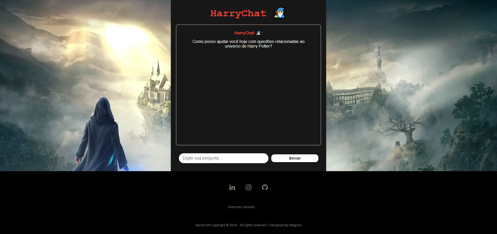
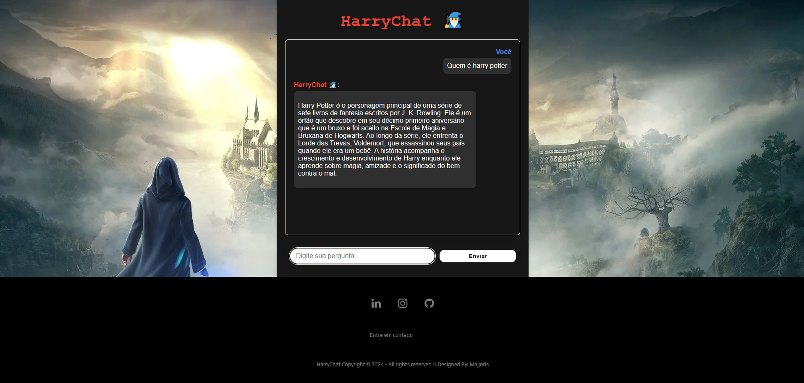

# Chatbot HARRY POTTER
Este código Python implementa um servidor web usando Flask que funciona como um chatbot especializado no universo de Harry Potter usando um modelo generativo avançado (Gemini 1.5 Flash) para gerar respostas e mantendo o contexto da conversa através do histórico, á tambem o processamento do texto para melhor correspondência de palavras-chave, e por fim entrega respostas formatadas em HTML para exibição em navegadores



## Instalação Local

Siga os passos para ter uma instancia do Chatbot execultando localmente.

### 1. Clone o Repositorio

```bash
git clone https://github.com/majjoris/ChatbotH.git
```

### 2. Instalar as dependências  

Abra um terminal no diretório raiz do seu repositório local do Chatbot e execute:

```bash
pip install requirements.txt
```
### Execulta o Chatbot localmente

No seu terminal, na raiz do repositório local do Chatbot, execute:
```bash
python app.py
```
Sua instância local do Chatbot agora deve estar em execução em [http://localhost:5000](http://localhost:5000).

### Funcionamento


